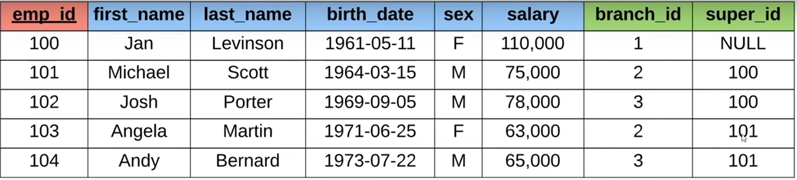

# SQL DATABASES

1. [What is db](#what-is-a-database)

## What is a database?

* Database is any collection of relative information

| Examples      | Ways to store |
|---------------|---------------|
| Phone book    | On paper      |
| Shooping list | On computer   |
| TODO list     | In mind       |

## Database management sistem (DMBS)

* A special software program that helps users create and mantain a database
    - Makes it easy to manage a large amount of information
    - Handles security
    - Backups
    - Importing/exporting data
    - Concurrency
    - interacts with software application 

## C.R.U.D.
* There are 4 main operations with databases:
    - CREATE
    - READ
    - UPDATE
    - DELETE

## Types of database

| Relational Databases      | Non-relational databases |
|---------------|---------------|
| Organize data into tables    | Does not orgonize data in traditional tables |
| each table has columns and rows | Key-value stores |
| A unique key identifies each row| Documents, graphs |

### Relational Databases (SQL)

* Examples:

| Student table | Users tables |
|---------------|---------------|
| ID NAME Major    | Username Password email |
| 1 Jack biology   | jsmith22 wordpass ... |
| 2 Kate Sociology | catlover44 ilovecats111 ... |
| 3 Ivan Math      | ... ... ... |

* SQL databases: (mySQL, PostgreSQL, Oracle, etc)

* Structured Query Language:
    - Standardized language for interaction with RDBMS
    - Performs CRUD operations and other
    - Used to define tables and structures

### Non-relational Databases (noSQL)

* Examples:

* Documents: JSON, XML, etc.
* GRAPHS: Relational nodes.
* Key-value: strings, maps, etc.

* NRDBMS
    - Helps users create and maintain NRDB
        - (mongoDB, dynamoBD, firebase, Redis, etc.)

* Implementation specific:
    - No standard language for NRDBMS
    - Own language for performing CRUD and administrative operations

## Database query

- Queries are request made to DBMS for information

## Tables and keys

- Unique ID's are used to specify a row and called `privary key`
- `foreign key` refers to privary key in another table

* in the employee table we have branch_id field which is privary key for branch table

- `composite key` is a key that needs two attributes
