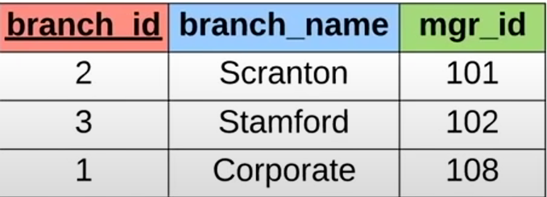
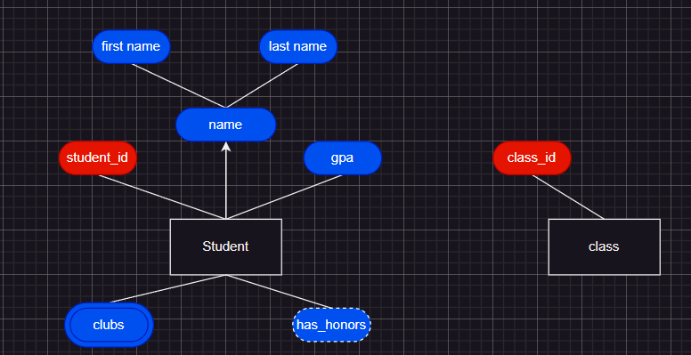
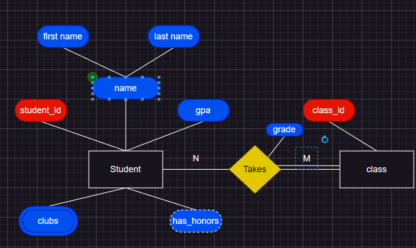

# SQL DATABASES

1. [What is a DB](#what-is-a-database)
2. [Database management system](#database-management-sistem-dmbs)
3. [CRUD](#crud)
4. [Types of database](#types-of-database)
    - 4.1 [Relational Databases](#relational-databases-sql)
    - 4.2 [Non-relational Databases](#non-relational-databases-nosql)
5. [Database query](#database-query)
6. [Tables and keys](#tables-and-keys)
7. [mySQL](#mysql)
8. [SQL](#sql)
    - 8.1 [Data types](#data-types)
    - 8.2 [Commands](#commands)
        - 8.2.1 [Database](#database)
        - 8.2.2 [Tables](#tables)
        - 8.2.3 [Table rows](#table-rows)
        - 8.2.4 [Add and Get record](#add--get-records)
        - 8.2.5 [Change and Delete record](#change--delete-record)
        - 8.2.6 [Basic queries](#basic-queries)
    - 8.3 [Company Database](#company-database)
    - 8.4 [Unions](#unions)
    - 8.5 [Constraints](#constraints)
    - 8.6 [Normalization](#db-normalization)
    - 8.7 [Joins](#joins)
    - 8.8 [Nested queries](#nested-queries)
    - 8.9 [On delete](#on-delete)
    - 8.10 [Triggers](#triggers)
9. [ER diagrams](#er-diagrams)


## What is a database?

* Database is any collection of relative information

| Examples      | Ways to store |
|---------------|---------------|
| Phone book    | On paper      |
| Shooping list | On computer   |
| TODO list     | In mind       |

## Database management sistem (DMBS)

* A special software program that helps users create and mantain a database
    - Makes it easy to manage a large amount of information
    - Handles security
    - Backups
    - Importing/exporting data
    - Concurrency
    - interacts with software application 

## C.R.U.D.
* There are 4 main operations with databases:
    - CREATE
    - READ
    - UPDATE
    - DELETE

## Types of database

| Relational Databases      | Non-relational databases |
|---------------|---------------|
| Organize data into tables    | Does not orgonize data in traditional tables |
| each table has columns and rows | Key-value stores |
| A unique key identifies each row| Documents, graphs |

### Relational Databases (SQL)

* Examples:

| Student table | Users tables |
|---------------|---------------|
| ID NAME Major    | Username Password email |
| 1 Jack biology   | jsmith22 wordpass ... |
| 2 Kate Sociology | catlover44 ilovecats111 ... |
| 3 Ivan Math      | ... ... ... |

* SQL databases: (mySQL, PostgreSQL, Oracle, etc)

* Structured Query Language:
    - Standardized language for interaction with RDBMS
    - Performs CRUD operations and other
    - Used to define tables and structures

### Non-relational Databases (noSQL)

* Examples:

* Documents: JSON, XML, etc.
* GRAPHS: Relational nodes.
* Key-value: strings, maps, etc.

* NRDBMS
    - Helps users create and maintain NRDB
        - (mongoDB, dynamoBD, firebase, Redis, etc.)

* Implementation specific:
    - No standard language for NRDBMS
    - Own language for performing CRUD and administrative operations

## Database query

- Queries are request made to DBMS for information

## Tables and keys

- Unique ID's are used to specify a row and called `primary key`
- `foreign key` refers to primary key in another table



* in the employee table we have branch_id field which is primary key for branch table

- `composite key` is a key that needs two attributes

## MySQL

* [download mysql macOS/windows](https://dev.mysql.com/downloads/mysql/)

* MySQL is a DBMS

## SQL

### Data Types

    - `INT`             // Whole number
    - `DECIMAL(M,N)`    // Decimal number - Exact value M - total digits, N - digits after decimal point
    - `VARCHAR(len)`    // String of text of lenght len
    - `BLOB`            // Binary large object(images, files)
    - `DATE`            // YYYY-MM-DD
    - `TIMESTAMP`       // YYYY-MM-DD HH:MM:SS - used for recording


### Commands

#### Database

- Create a database: 
```sql
create database <dbname>;
```

#### Tables

- [!] To migrate into mysql i used migrate -path ./migrations/ -database mysql://root@tcp(localhost:3306)/sql-tutorial?query up (does not work in powershell, cmd only)

- Create table:
```sql
CREATE TABLE <name>;
```

- Delete table: 
```sql
DROP TABLE <name>;
```

- Get table description
```sql
DESCRIBE <tablename>;
```

#### Table rows

- Add new field to the table
```sql
ALTER TABLE student ADD <fieldname> DECIMAL(3,1);
```

- Delete the field to the table
```sql
ALTER TABLE student DROP <fieldname>;
```

#### Add & Get records

- Add new record to the table (example)
```sql
INSERT INTO student VALUES(1, "Jack", "Biology");
```

- Get all records from the table (example)
```sql
SELECT * FROM `student`;
```

- Add new record to the table without one field (example)
```sql
INSERT INTO `student`(`id`, `name`) VALUES(3, "Clair");
```

#### Change & Delete record

- Change field value
```sql
UPDATE `student` SET `major`='biology' WHERE major = 'bio'
```

- Change field with multiple conditions
```sql
UPDATE student SET major = 'biochemistry' WHERE major = 'chemistry' OR major = 'bio'
```

- Change multiple fields
```sql
UPDATE `student` SET `name`='Victor',`major`='Science',`gpa`='5' WHERE id = 1
```

- Change field for every row
```sql
UPDATE `student` SET `gpa`=0.0
```

- Delete a row from table
```sql
DELETE FROM students WHERE id = 1
```

- Delete rows with multiple conditions
```sql
DELETE FROM `student` WHERE name = 'Nemo' AND major = 'Biology'
```

#### Basic queries

- Get records sort by name
```sql
SELECT `id`, `name`, `major`, `gpa` FROM `student` ORDER BY name
```

- Get records sort by name desc order
```sql
SELECT `id`, `name`, `major`, `gpa` FROM `student` ORDER BY name DESC
```

- Get records sort by name then by major 
```sql
SELECT `id`, `name`, `major`, `gpa` FROM `student` ORDER BY name, major
```

- Get records with record limit
```sql
SELECT `id`, `name`, `major`, `gpa` FROM `student` LIMIT <amount>;
```

- Get records where id is not equal to 1 (also works with multiple conditions)
```sql
SELECT * FROM `student` WHERE id <> 1;
```

- Get records where name is one of represented (also works with multiple conditions)
```sql
SELECT * FROM `student` WHERE name IN ('Fox', 'Nemo', 'Victor')
```

### Company Database

- Creating employee table
```sql
   CREATE TABLE employee (
	emp_id INT PRIMARY KEY,
    first_name VARCHAR(40),
    last_name VARCHAR(40),
    birth_day DATE,
    sex VARCHAR(1),
    salary INT,
    super_id INT,
    branch_id INT
);
```

- Creating branch table
```sql
CREATE TABLE branch (
    branch_id INT PRIMARY KEY,
    branch_name VARCHAR(40),
    mgr_id INT,
    mgr_start_date DATE,
    -- defining foreign key mrg_id to eployee table primary key
    FOREIGN KEY(mgr_id) REFERENCES employee(emp_id) ON DELETE SET NULL
);
```

- Defining foreign keys for employee table
```sql
-- adding foreign key (counld not do it before because branch table was not created)
ALTER TABLE employee
ADD FOREIGN KEY(branch_id)
REFERENCES branch(branch_id)
ON DELETE SET NULL;

ALTER TABLE employee
ADD FOREIGN KEY(super_id)
REFERENCES employee(emp_id)
ON DELETE SET NULL;
```

- Creating client table
```sql
CREATE TABLE client (
	client_id INT PRIMARY KEY,
    client_name VARCHAR(40),
    branch_id INT,
    FOREIGN KEY(branch_id) REFERENCES branch(branch_id)
    ON DELETE SET NULL
);
```

- Creating works-with table
```sql
CREATE TABLE works_with (
	emp_id INT,
    client_id INT,
    total_sales INT,
    PRIMARY KEY(emp_id, client_id),
    FOREIGN KEY(emp_id) REFERENCES employee(emp_id)
    -- error will occur if ON DELETE SET NULL used
    ON DELETE CASCADE,
	FOREIGN KEY(client_id) REFERENCES client(client_id)
    -- error will occur if ON DELETE SET NULL used
    ON DELETE CASCADE
);
```
- Creating branch_supplier table
```sql
CREATE TABLE branch_supplier (
    branch_id INT,
    supplier_name VARCHAR(40),
    supply_type VARCHAR(40),
    PRIMARY KEY(branch_id, supplier_name),
    FOREIGN KEY(branch_id) REFERENCES branch(branch_id)
    ON DELETE CASCADE
);
```
- [!] ON DELETE CASCADE Indicates that when the row in the parent table is deleted, the dependent rows in the child table will also be deleted. ON DELETE SET NULL Covert foreign key values to null when the parent value is removed. Without the ON DELETE CASCADE or the ON DELETE SET NULL options, the row in the parent table cannot be deleted if it is referenced in the child table

- Adding records to tables (example)
```sql
INSERT INTO employee VALUES(100, "David", "Wallace", '1967-11-17', 'M', 250000, NULL, NULL);
INSERT INTO branch VALUES(1, "Corporate", 100, '2006-02-09');

UPDATE employee SET branch_id = 1 WHERE emp_id = 100;

INSERT INTO employee VALUES(101, 'Jan', 'Levinson', '1965-05-11', 'F', 110000, 100, 1);
```

- Getting `first name` from every record in table but in response field will be `name`
```sql
SELECT first_name AS name FROM `employee`
```

- Get only unique first names from table
```sql
SELECT DISTINCT first_name FROM employee
```

- Get amount of the employees
```sql
SELECT COUNT(emp_id) FROM employee;
```

- Get only unique first names from table
```sql
SELECT DISTINCT first_name FROM employee;
```

- find the number of female employees born after 1970
```sql
SELECT * FROM employee WHERE sex = 'F' AND birth_date > '1971-01-01';
```
- Find average salary
```sql
SELECT AVG(salary) FROM employee;
```

- Find the sum of all salaries
```sql
SELECT SUM(salary) FROM employee;
```

- Find amount of males and females in the company
```sql
SELECT COUNT(sex), sex FROM employee GROUP BY sex;
```

- Find how much each client spent
```sql
SELECT SUM(total_sales), client_id FROM works_with GROUP BY client_id;
```

- Find clients who are LLC (`%` means any character, `_` means one character)
```sql
SELECT * FROM clients WHERE client_name LIKE '%LLC';
```

- Find employee born in october
```sql
SELECT * FROM employee WHERE birth_date LIKE '_____10%';
```

- [!] **Every** sql query ends with a **semicolon** `;`

### Unions

- Let us combine multiple SELECT statements into one result

- Get employee
```sql
SELECT first_name FROM employee UNION SELECT branch_name FROM branch;
```
- [!] Both select statements must have same amount of columns and similar data types of columns

### Constraints

    - `NOT NULL`        - field can not be NULL
    - `Unique`          - no duplication of this field in other rows
    - `DEFAULT <val>`   - Has a default value
    - `AUTO_INCREMENT`

### DB Normalization
- Database normalization provides for reduction to normal form
- Normal form 1:
    - no duplicated rows
    - all atributes are atomic
    - no dublicated atributes with common mean
- Normal form 2:
    - Conditions of NF1 are met
    - Have a primary key
    - all non-key attributes depend on **whole** primary key
- Normal form 3:
    Conditions of NF2 are met
    - Non-key attrubutes are depend **only** on primary key and not depend on other atrubutes.

### Joins

- Joins combines rows from two or more tables based on a related column between them

- Find all branches and the names of their managers
```sql
SELECT employee.emp_id, employee.first_name, branch.branch_name
FROM employee JOIN branch ON employee.emp_id = branch.mng_id
```

- Find all branches and the names of their managers and print other employee after (using `LEFT JOIN`)
```sql
SELECT employee.emp_id, employee.first_name, branch.branch_name
FROM employee LEFT JOIN branch ON employee.emp_id = branch.mng_id
```

- Find all branches and the names of their managers and print remaining branches (using `RIGHT JOIN`)
```sql
SELECT employee.emp_id, employee.first_name, branch.branch_name
FROM employee RIGHT JOIN branch ON employee.emp_id = branch.mng_id
```

- [!] `FULL JOIN` is a combination of LEFT and RIGHT JOIN. **Not represented** in mySQL
- [!] `INNER JOIN` is the basic JOIN itself

### Nested queries

- Using multiple SELECT statements in order to get specific piece of information

- Find names of all employee who have sold over 30k to a single client
```sql
SELECT employee.first_name, emloyee.last_name FROM employee
WHERE employee.emp_id IN (
    SELECT works_with.emp_id FROM works_with
    WHERE works_with.total_sales > 30000;
);
```

- Find all clients who are handled by the branch that employee 102 manages
```sql
SELECT FROM client.client_name FROM client WHERE client.branch_id = (
    SELECT branch.branch_id FROM branch WHERE branch.mgr_id = 102
)
```

### ON DELETE

- `ON DELETE SET NULL` - sets foreign_key value to NULL if foreign key does not refer to existing data anymore
- `ON DELETE CASCADE` - deletes the row if foreign key does not refer to existing data anymore

We can use `SET NULL` if foreign key is not used as a primary key, so it is not essential.

### Triggers

- Triggers allow us to set certain behavior if something changes in database

- Add message to trigger_test table if new record was inserted into employee table
```sql
DELIMITER $$
CREATE TRIGGER my_trigger BEFORE INSERT ON employee
	FOR EACH ROW BEGIN
    	INSERT INTO trigger_test VALUES('new employee added');
    END$$
DELIMITER ;
```
- [!] Delimiter changes delemitr from `;` to selected. It is required because it will naturally end query after `;`

- Add message with name of a new employee to trigger_test table if new record was inserted into employee table 
```sql
DELIMITER $$
CREATE TRIGGER my_trigger_2 BEFORE INSERT ON employee
	FOR EACH ROW BEGIN
    	INSERT INTO trigger_test VALUES(NEW.first_name);
    END$$
DELIMITER ;
```

- Delete trigger 'my_trigger'
```sql
DROP TRIGGER my_trigger
```

## ER diagrams

- ER stands for entity relationship diagrams

- `Entity` -- an object we want to model & store information about
- `attributes` -- specific piece of information about an entity

- How to display entity and it's attributes
- 

- `Primary key` uniquely identifies an entity in the table
- 

- `Composite attribute` is an attribute that can be broken up into sub-attributes
- 
- [!] arrow end is not required

- `Multi-valued attribute` is an attribute that contains more then one value
- 

- `Derived attribute` -- attribute that can be derived  from the other attributes
- 

- `Multiple entities` -- diagram can have more then one entity
- 

- `Relationship` defines a relationship between two entities
- `Total participation` means all members participate in the relationship
- 
- [!] Not all students have to take a class but a class must be taken by at least one student

- `Relationship attribute` -- an attribute about the relationship
- 

- `Relationship cardinality` is the number of instances of an entity from a relation that can be associated with the relation
- cardinalities can be: 1:1, 1:N, N:M
- 

- `Weak entity` is an entity that cannot be uniquely identified and depends on different entity
- `Identifying relationship` - relationship that serves to uniquely identify the week entity
- 


